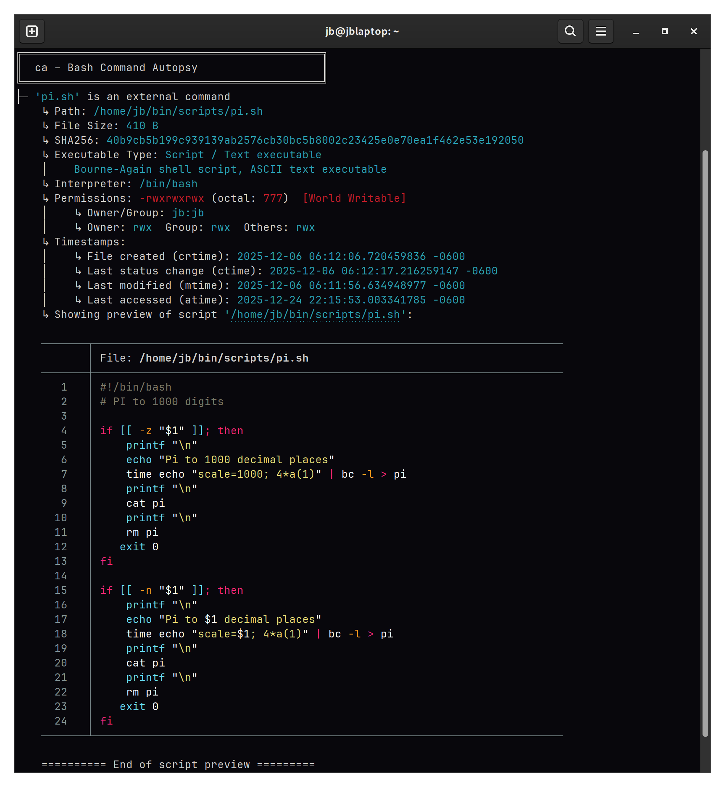

# ca – Bash Command Autopsy

---

[](LICENSE)
[](https://github.com/JB63134/bash_ca/releases) 


`ca` is an interactive Bash command analyzer that explains **what a command really is**, **where it comes from**, and **why Bash resolves it the way it does**.

It inspects aliases, functions, builtins, keywords, scripts, and binaries, then traces how commands expand and resolve in your shell. The goal is to make Bash behavior transparent, especially in heavily customized environments.

Think of it as `type`, `which`, `help`, `file`, `ldd`, `stat`, and half your shell configuration, available through a single command.

Requires: Bash ≥ V4.4 and GNU utils  
Package Lookup: supports dpkg, rpm, and pacman   
Sourced file detection: supports Debian and Fedora / RHEL style setups  
   
---

## Features

### Command Resolution
- Detects whether a command is an **alias, function, builtin, keyword, or external binary**
- Recursively analyzes alias expansions and command chains
- Traces command resolution order and `$PATH` precedence
- Automatically analyzes your **most recent command** if none is specified
- Prevents infinite recursion and cyclic alias loops

### Alias, Function, and Builtin Inspection
- Displays alias expansions and where they are defined
- Locates function definitions with file and line numbers
- Shows syntax-highlighted previews of function bodies
- Detects disabled builtins and what replaces them
- Identifies commands overridden by aliases, functions, or binaries

### External Binary Analysis
- Resolves full paths and symbolic links
- Displays file type, interpreter, ELF details, and linkage
- Lists shared library dependencies and flags missing ones
- Shows binary size in human-readable units
- Reports permissions, ownership, and security risks (SUID, SGID, world-writable)
- Flags commands that likely require root privileges
- Displays file timestamps (create, modify, access, change)

### Shell Environment Visibility
- Lists all sourced shell files, including conditional and loop-based sourcing
- Lists all environment variables
- Lists all variables loaded by sourced files that are found
- Scans `$PATH` and highlights writable directories
- Identifies user-writable commands
- Shows shell options that differ from defaults
- Maps command shadowing and override conflicts

### Security & Auditing Tools
- Scans for SUID and SGID binaries
- Finds world-writable directories
- Verifies package integrity (dpkg, rpm, pacman)
- Highlights potentially dangerous overrides and path issues

### Usability
- Designed for interactive Bash shells
- Colorized, structured output with safe fallbacks
- Optional `fzf` integration for interactive command selection
- Tab completion for aliases, functions, builtins, and executables
- Modular dependency checking (required vs optional tools)

---

## Options

| Option               | Description                                                |
| -------------------- | ---------------------------------------------------------- |
| `-h`, `--help`       | Show help text                                             |
| `-v`, `--version`    | Show version information                                   |
| `-a`, `--aliases`    | List all aliases                                           |
| `-f`, `--functions`  | List user-defined functions                                |
| `-fv`, `--funverb`   | List all functions (verbose)                               |
| `-F`, `--forensic`   | `-t` and `-V `  forensic report                            |
| `--fzf`              | Interactive command selection via fzf                      |
| `-d`, `--diff`       | Show shell options changed from defaults                   |
| `-l`, `--listenv`    | List all system variables (printenv / env)                 |
| `-o`, `--overridden` | List overridden commands                                   |
| `-p`, `--path`       | Inspect `$PATH` and highlight writable directories         |
| `-s`, `--sourced`    | List sourced shell files                                   |
| `-S`, `--scan`       | Scan for SUID/SGID binaries and world-writable directories |
| `-t`, `--trace`      | Show command resolution order                              |
| `-u`, `--user`       | List user-writable commands                                |
| `-V`, `--verify`     | Verify package integrity (dpkg, rpm, pacman)               |
| `--var`              | List all variables loaded by sourced files                 |

---

## Installation

### 1. Manual Installation

Clone the repository.
```bash
# Clone the repository.
git clone https://github.com/JB63134/bash_ca.git /usr/local/bin/bash_ca

# Source the main script in your .bashrc or .bash_profile
echo "source /usr/local/bin/bash_ca/.bash_ca" >> ~/.bashrc

# Apply changes immediately
source ~/.bashrc
```


### 2. Debian/Ubuntu `.deb` Package

A quick method for Debian-based systems:

```bash
# Download the latest release
wget https://github.com/JB63134/bash_ca/releases/latest/download/ca_1.1.25.deb

# Install using dpkg
sudo dpkg -i ca_1.1.25.deb

# Verify installation
ca -h
```
### 3. Fedora `.rpm` Package

A quick method for RHEL-based systems:

```bash
# Download the latest release
wget https://github.com/JB63134/bash_ca/releases/latest/download/bash_ca-1.1.25-1.noarch.rpm

# Install using dpkg
sudo dnf install ./bash_ca-1.1.25-1.noarch.rpm

# Verify installation
ca -h
```
---

## Usage

```bash
ca [command]
```

If no command is provided, `ca` analyzes the **last executed command**.

### Examples

```bash
ca
ca ls
ca awk
ca -o
ca -t awk
```
---

## Screenshots / Output Preview





---


