# ca – Bash Command Analyzer

---

[](LICENSE)
[](https://github.com/JB63134/bash_ca/releases) 


`ca` is an interactive Bash command analyzer that explains **what a command really is** and **where it comes from**.

It inspects aliases, functions, builtins, keywords, scripts, and binaries.

Think of it as `type`, `which`, `help`, `file`, `ldd`, `stat`, and half your shell configuration, available through a single command.

Requires: Bash ≥ V4.4 and GNU utils  
Package Lookup: supports dpkg, rpm, and pacman   
   
---

## Features

### Command Resolution
- Detects whether a command is an **alias, function, builtin, keyword, or external binary**
- Automatically analyzes your **most recent command** if none is specified

### Alias, Function, and Builtin Inspection
- Displays alias expansions and where they are defined
- Locates function definitions with file and line numbers
- Shows syntax-highlighted previews of function bodies
- Detects disabled builtins and what replaces them
- Identifies commands overridden by aliases, functions, or binaries

### External Binary Analysis
- Resolves full paths and symbolic links
- Displays file type, interpreter, ELF details, and linkage
- Lists shared library dependencies and flags missing ones
- Shows binary size in human-readable units
- Reports permissions, ownership, and security risks (SUID, SGID, world-writable)
- Flags commands that likely require root privileges
- Displays file timestamps (create, modify, access, change)

### Shell Environment Visibility
- Lists all sourced shell files, including conditional and loop-based sourcing
- Lists all environment variables
- Lists all variables loaded by sourced files that are found
- Scans `$PATH` and highlights writable directories
- Identifies user-writable commands
- Shows shell options that differ from defaults
- Maps command shadowing and override conflicts

### Security & Auditing Tools
- Scans for SUID and SGID binaries
- Finds world-writable directories
- Verifies package integrity (dpkg, rpm, pacman)
- Highlights potentially dangerous overrides and path issues

### Usability
- Designed for interactive Bash shells
- Colorized, structured output with safe fallbacks
- Optional `fzf` integration for interactive command selection
- Tab completion for aliases, functions, builtins, and executables
- Modular dependency checking (required vs optional tools)

---

## Options

| Option               | Description                                                |
| -------------------- | ---------------------------------------------------------- |
| `-h`, `--help`       | Show help text                                             |
| `--version`          | Show version information                                   |
| `-o`, `--overridden` | List overridden commands                                   |
| `-a`, `--alias`      | List all aliases                                           |
| `-f`, `--function`   | List user-defined functions                                |
| `-F`, `--functionv`  | List all functions (verbose)                               |
| `-d`, `--diff`       | Show shell options changed from defaults                   |
| `-e`, `--env`        | List all system variables (printenv / env)                 |
| `-s`, `--sourced`    | List sourced shell files                                   |
| `-l`,`--listvar`     | List all variables loaded by sourced files                 |
| `-p`, `--path`       | Inspect `$PATH` and highlight writable directories         |
| `-u`, `--user`       | List USER-writable commands                                |
| `-S`, `--scan`       | Scan for SUID/SGID binaries and world-writable directories |
| `-v`, `--verify`     | Verify package integrity (dpkg, rpm, pacman)               |
| `-r`, `--report`     | Full report (includes -t, ca [command], and -v)            |
| `--fzf`              | Interactive command selection via fzf                      |


---

## Installation

### 1. Manual Installation

Clone the repository.
```bash
# Clone the repository.
git clone https://github.com/JB63134/bash_ca.git /usr/local/bin/bash_ca

# Source the main script in your .bashrc or .bash_profile
echo "source /usr/local/bin/bash_ca/.bash_ca" >> ~/.bashrc

# Apply changes immediately
source ~/.bashrc
```


### 2. Debian/Ubuntu `.deb` Package

A quick method for Debian-based systems:

```bash
# Download the latest release
wget https://github.com/JB63134/bash_ca/releases/latest/download/ca_2.0.15.deb

# Install using dpkg
sudo dpkg -i ca_2.0.15.deb

# Verify installation
ca -h
```
### 3. Fedora `.rpm` Package

A quick method for RHEL-based systems:

```bash
# Download the latest release
wget https://github.com/JB63134/bash_ca/releases/latest/download/bash_ca-2.0.15-1.noarch.rpm

# Install using dpkg
sudo dnf install ./bash_ca-2.0.15-1.noarch.rpm

# Verify installation
ca -h
```
---


## Usage

```bash
ca [command]
```

### Examples

```bash
ca ls
ca -v sed
ca -t awk
ca -r bash
```
---

## Screenshots / Output Preview


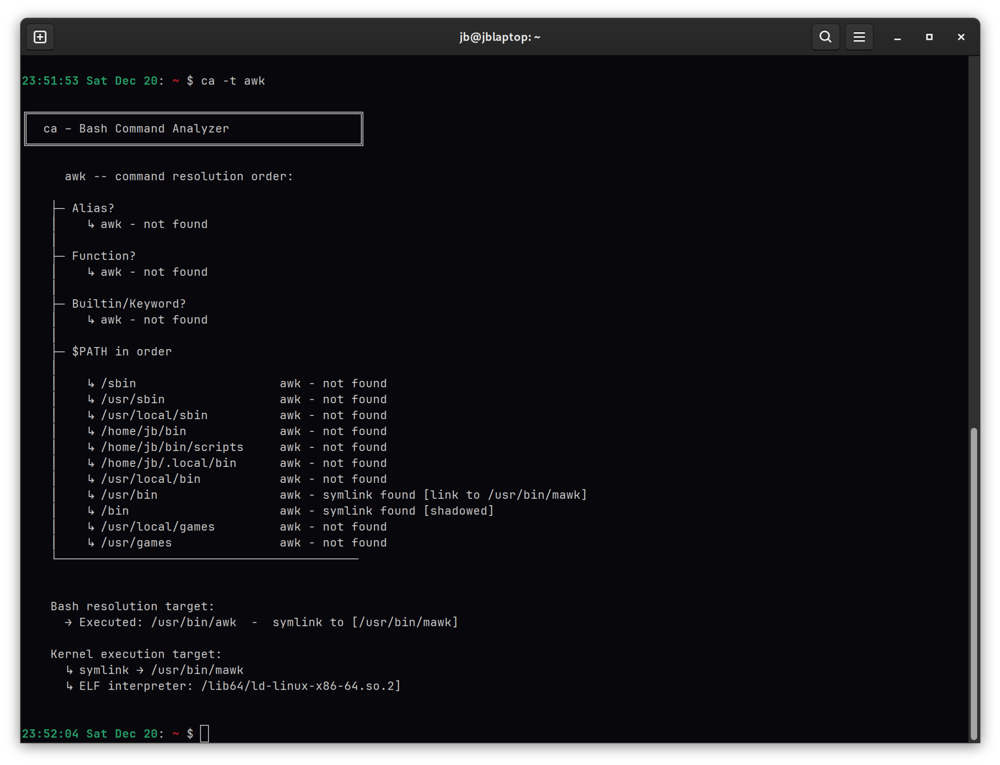
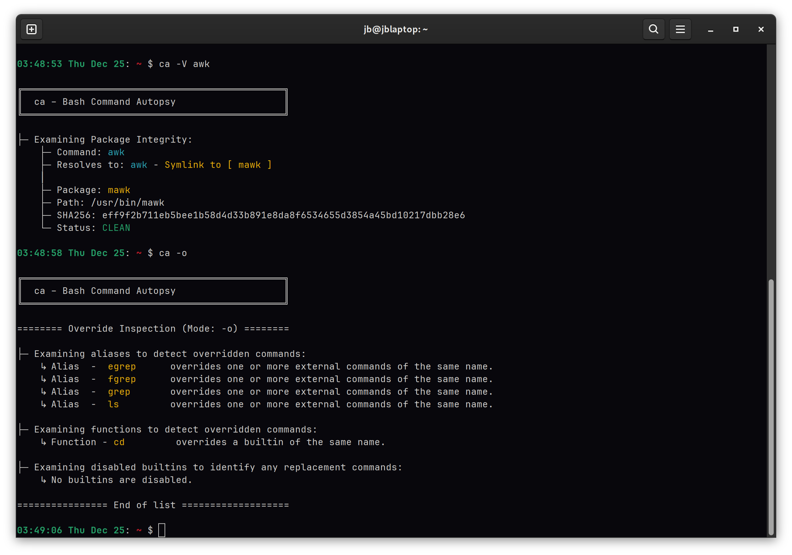
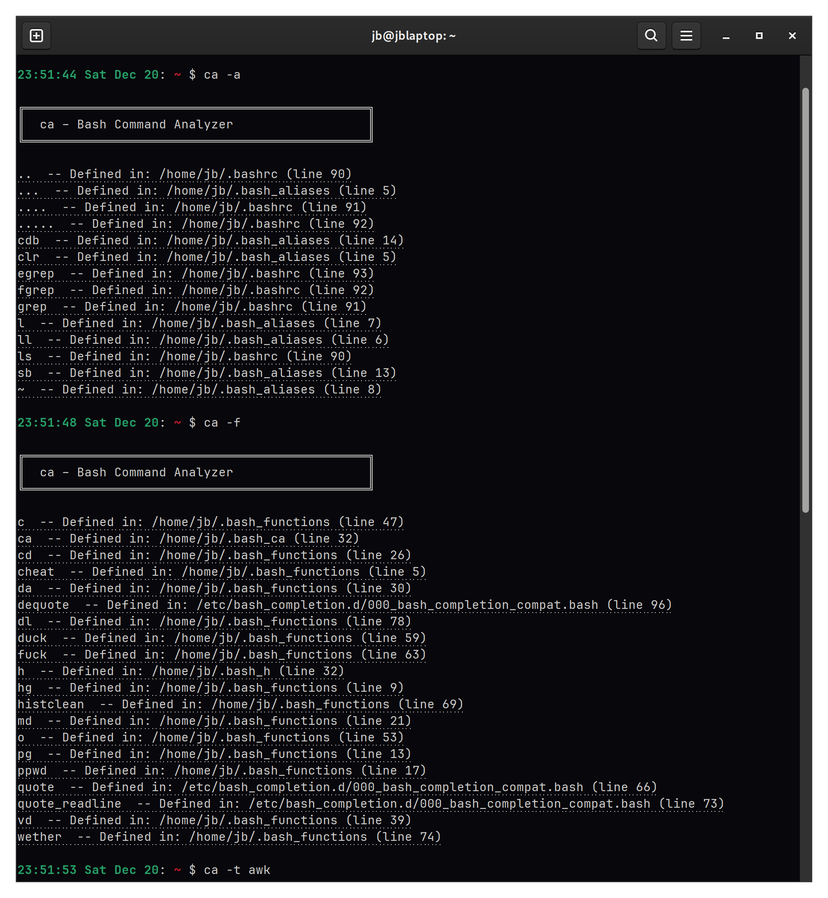
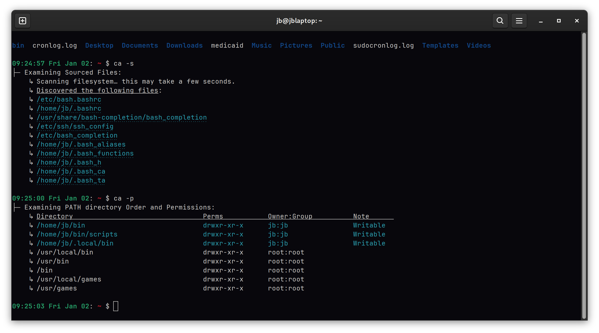
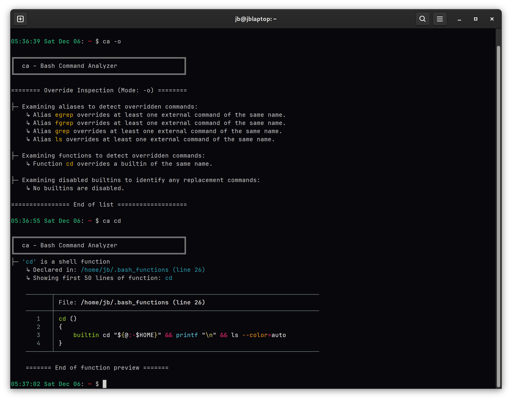
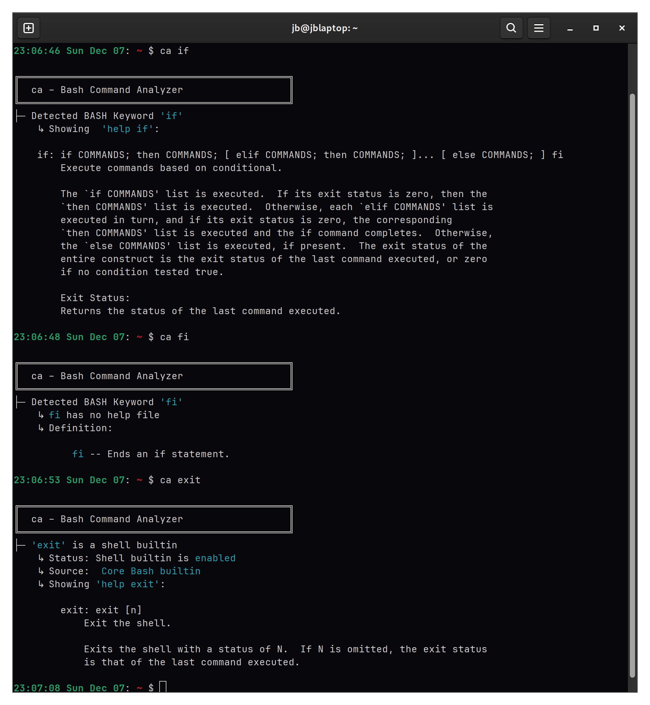
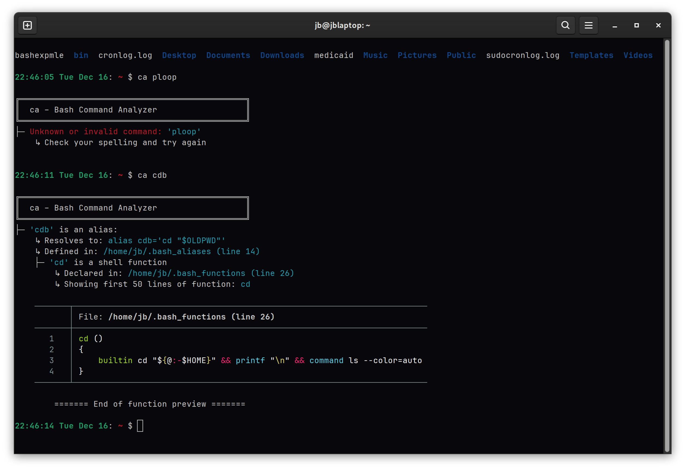
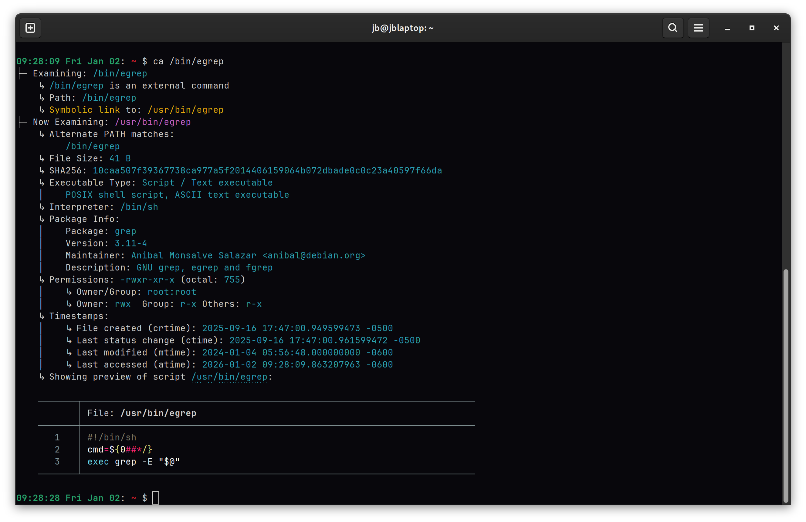
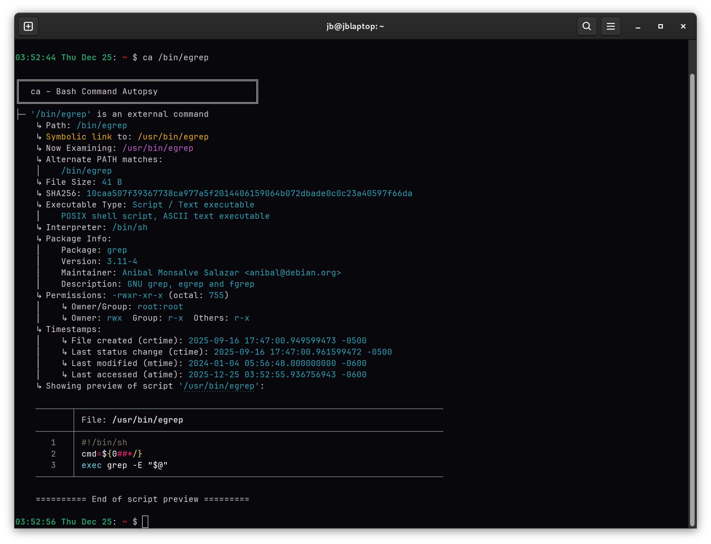
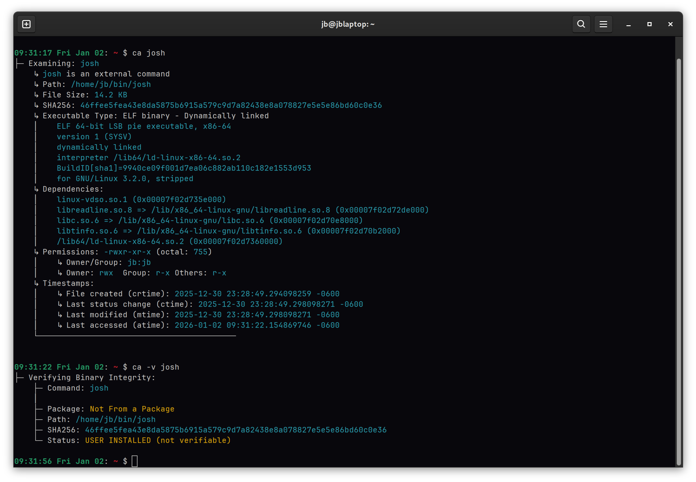
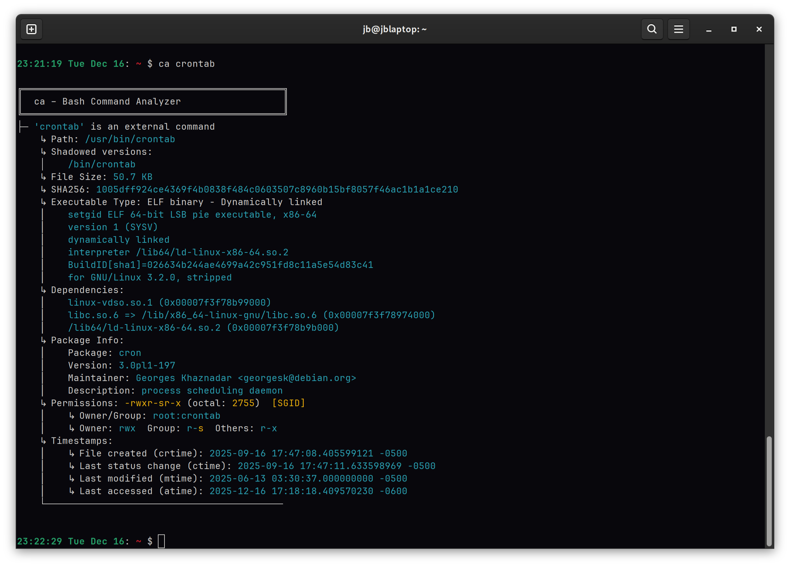
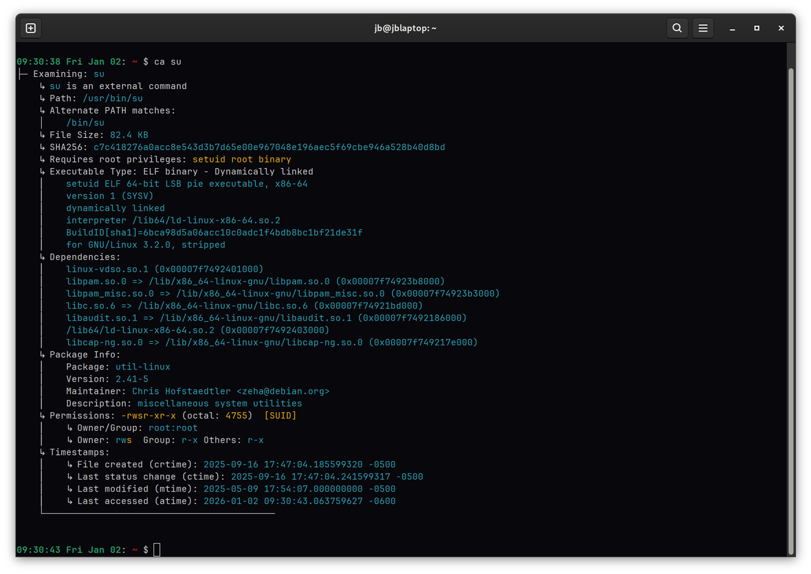
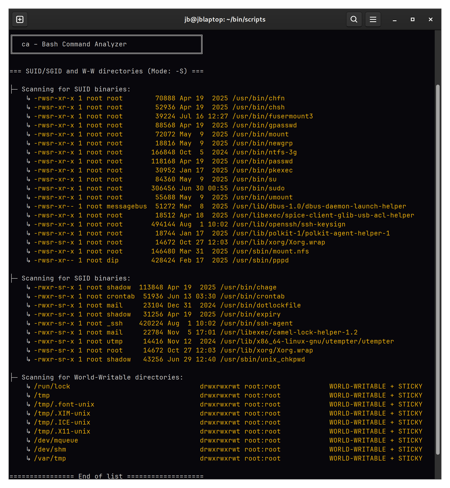

---


